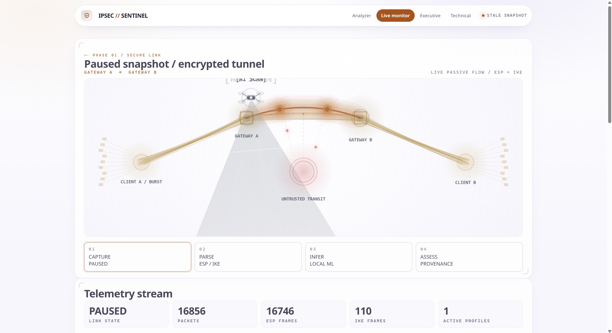
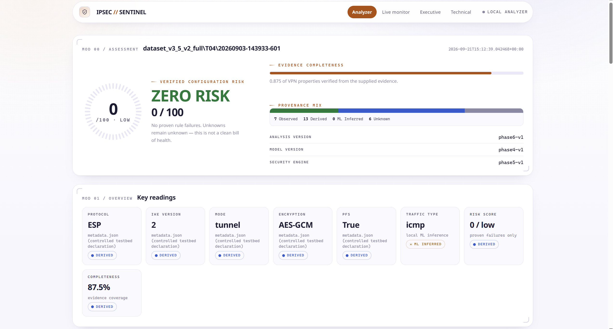
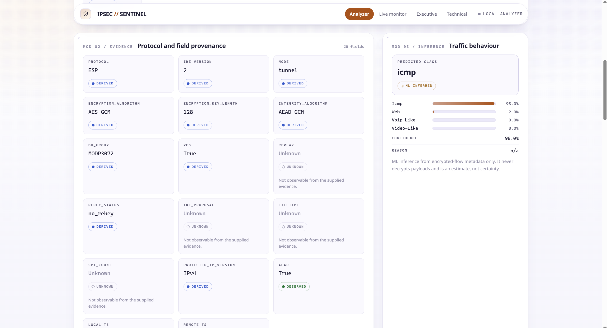
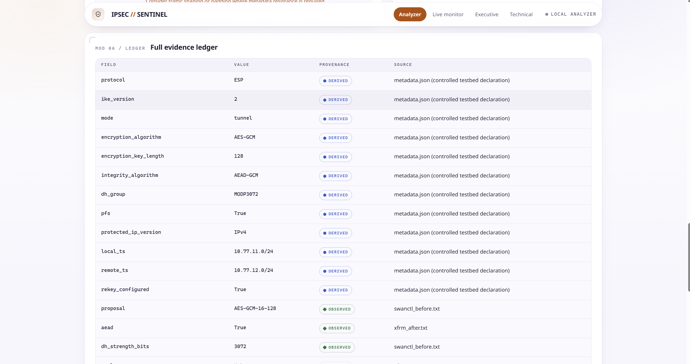
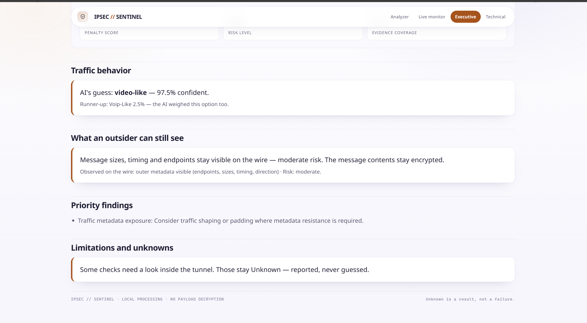

# IPsec Sentinel — AI-Driven IPsec VPN Security Analyzer

See what a VPN hides — and what it cannot hide — **without decrypting anything**.

Point Sentinel at a packet capture (or watch it live) and it tells you, with evidence for every claim: which traffic behavior the local ML model sees, which security properties are proven, and which stay **Unknown** instead of being guessed.

## The app in 30 seconds

Four pages, one story:

| Page | What you see |
|---|---|
| **Live monitor** (`/live`) | Gateway A ↔ Gateway B topology with live packet pulses, telemetry counters, packet feed, and per-tunnel threat evidence. |
| **Analyzer** (`/`) | Paste a run directory or PCAP path (or click a sample) to get a full offline assessment. |
| **Executive** (`/executive`) | Verified-configuration risk gauge, traffic behavior, priority findings, and limitations — the one-page summary. |
| **Technical** (`/technical`) | Full evidence ledger, ML probabilities, and security findings for deep review. |


*Live monitor: Client A → Gateway A → untrusted transit → Gateway B → Client B, with live packet pulses, telemetry counters, and per-tunnel threat evidence.*


*Analyzer: verified-configuration risk, evidence completeness, provenance mix, and key readings for a saved run.*


*Protocol and field provenance tiles plus ML traffic behavior with confidence and reason.*


*Security findings, residual threat matrix, and the full evidence ledger with provenance per field.*


*Executive report: traffic behavior, outsider-visible metadata, priority findings, and limitations on one page.*

## Get started

### Prerequisites

- **Docker Desktop** (for the live testbed + packet transfer).
- **Python 3.11+** (for running the dashboard directly; the containers use `python:3.11`).

### Option A — Watch a live packet transfer (recommended first run)

```powershell
# 1. Start the 4-container IPsec testbed (Client A -> Gateway A -> transit -> Gateway B -> Client B)
docker compose -f testbed/compose/testbed.yml up -d

# 2. Start capture -> monitor -> dashboard
powershell -File scripts/start-live-monitor.ps1

# 3. Send traffic (new terminal, ~30 seconds of video-like flow)
docker exec sih-client-a python3 /traffic/generator.py --profile video-like --duration 30 --seed 20260904 --peer 10.77.2.10

# 4. Open the dashboard
# http://127.0.0.1:8501/live
```

> Capture must run on the gateways' **transit** interface (`eth0`), not the protected side — otherwise ESP on the wire is never recorded.

Or run the fully scripted demo (teardown → capture-before-negotiation → IKE → traffic → ML → assessment):

```powershell
powershell -File scripts/live-demo.ps1 -Duration 20
```

### Option B — Analyze a saved capture (no Docker needed)

```powershell
# Start the dashboard
python app/app.py   # http://127.0.0.1:8501

# Open the Analyzer page and enter a run directory or PCAP, e.g.
# dataset_v3_5_v2_full/T04/20260903-143933-601
```

Or from the command line:

```powershell
# Offline analysis of one run (verbose summary)
python integration/analyze.py --run dataset_v3_5_v2_full/T04/20260903-143933-601 --summary

# PCAP-only analysis
python integration/analyze.py --pcap captures/monitor/live_current.pcap
```

### Option C — Generate reports

```powershell
python reports/generate_report.py --input integration/results/t15_result.json --out reports/results
# -> executive_<stem>.html + technical_<stem>.html + assessment_<stem>.json
```

## How to read the results

- **Risk `0 / 100` means “no proven failures” — not “secure.”** The score only adds penalties for proven rule violations.
- **Unknown is a result, not a failure.** Passive ESP ciphertext cannot prove inner crypto details (algorithm, key size, PFS, replay protection), so those stay Unknown with a reason.
- **Provenance chips** on every value: `Observed` (seen on the wire), `Derived` (computed), `ML Inferred` (model estimate), `Unknown`.
- **ML abstains below 60% confidence** instead of guessing (`below_threshold` → Unknown).

## Repository layout

```text
testbed/                 4-container IPsec testbed (compose, strongSwan configs, scenarios, traffic generator)
analyzer/                passive PCAP feature extraction
ml_v2/                   traffic classifier: model, schema, prediction CLI  (see ml_v2/model_card.md)
ml/                      legacy training/evaluation scripts
security/                deterministic assessment engine + policy
monitor/                 live tail monitor, session correlator, ML/security bridges, live dashboard contract
integration/             unified offline pipeline (analyze.py)
app/                     dashboard server (standard library only)
ui/                      shared theme: Noto Sans, government-light tokens, components
reports/                 executive/technical report generator
scripts/                 start-live-monitor.ps1, live-demo.ps1, final-validation.ps1
dataset_v3_5_v2_full/    frozen reference dataset (v3.5-v2)
docs/                    full documentation set (start with docs/README.md)
```

## Verify your setup

```powershell
# Testbed health (gateways, SAs, capture path)
powershell -File testbed/scripts/check-testbed.ps1

# Unit + regression tests
python -m pytest -q

# End-to-end validation record
powershell -ExecutionPolicy Bypass -File scripts/final-validation.ps1
```

## Documentation

Start with `docs/README.md`, then as needed: `docs/USER_GUIDE.md` (using the UI), `docs/TESTBED.md`, `docs/ARCHITECTURE.md`, `docs/LIMITATIONS.md`, `ml_v2/model_card.md`.

## Known limitations (short version)

- No payload decryption — inner crypto properties are Unknown unless runtime/config evidence exists.
- Traffic classes (`icmp`, `web`, `voip-like`, `video-like`) are synthetic behaviors, not real apps.
- Small controlled synthetic dataset; real-world generalization is not proven.
- Metadata side channels (sizes, timing, direction, endpoints) stay observable.

Details: `docs/LIMITATIONS.md`.
